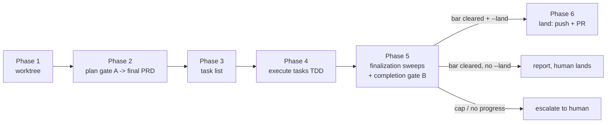

# Review Loop

Drive ONE feature through its whole lifecycle to a numeric quality bar:



Both gates score the work on three dimensions and loop - revising with the
reviewers' findings - until every dimension clears the bar or the cycle cap
stops the loop and hands to a human. Runs identically in a bare OMP session and
inside an AgentDesk-backed one: all delegation is native, in-process OMP `task`
subagents, never a runtime-specific route.

## Inputs

Parse `$ARGUMENTS`:

- Target: a feature description, a PRD path (`PRDs/CURRENT/...`), a worktree
  path, or a feature slug.
- `--bar` (default 9.5): per-dimension pass threshold, 0-10.
- `--max-cycles` (default 5): hard cap on revise-and-re-review cycles per gate.
- `--land`: after the completion gate clears, land the feature (push + PR via
  the repo's worktree scripts). Without it, the loop stops at the report and
  the human owns the irreversible step.
- Per-dimension overrides if given (e.g. security blocking, simplification 9.0).

If the target is missing, ask once. Everything else has a default; do not
interrogate the user for parameters they did not raise.

## Phase detection (always run first)

The loop is resumable: a feature may arrive with a PRD already written, code
already implemented, or a gate already cleared. Detect the phase from durable
state, never from memory. Check in order:

1. **Worktree**: does a feature worktree exist? (`scripts/worktree/list-features.sh`
   if the repo has it, else `git worktree list`; is cwd already inside one?)
2. **PRD**: does `PRDs/CURRENT/<feature>.md` exist?
3. **Plan gate**: does the PRD's `## Review Loop State` section record
   `plan gate: CLEARED`?
4. **Execution**: are WBS tasks checked off with test evidence? Is there a
   diff ahead of main in the worktree?
5. **Completion gate**: does `## Review Loop State` record completion-gate
   cycles/scores? Cleared?

Entry table (first row that matches, top to bottom):

| Durable state observed | Resume at |
|---|---|
| Completion gate CLEARED, `--land` given | Phase 6: land |
| Completion gate CLEARED, no `--land` | Report; stop |
| All WBS tasks done / work claimed complete | Phase 5: sweeps + gate B |
| Plan gate CLEARED, tasks incomplete | Phase 3 (rebuild task list) then 4 |
| PRD exists, plan gate not cleared | Phase 2: gate A on the existing PRD |
| Worktree exists, no PRD | Phase 2 (write PRD in the worktree) |
| Nothing | Phase 1 |

Never re-run a gate that durable state says cleared, and never trust a
"cleared" claim that has no scores recorded behind it.

## Reviewers and sweep workers (in-process, pinned models)

All delegation uses in-process OMP `task` subagents with model pinned in the
agent definition (`~/.omp/agent/agents/*.md`) - cheaper than spawning peer
processes, visible in AgentDesk session activity, and lifecycle-managed (idle
agents park; no orphan processes):

Every plan and completion gate MUST consult BOTH `openai-think` and
`anthropic-think` before scoring. A gate cannot clear when either role is
missing, fails, or returns no actionable assessment. Give both the same
factual packet independently; add their findings to the scorer packet.

- `reviewer-gpt55` - read-only scorer, `openai-codex/gpt-5.5:xhigh`.
- `reviewer-opus` - read-only scorer, latest Opus (`anthropic/claude-opus-4-8:high`).
- `sweep-gpt55` - edit-capable worker, GPT-5.5: simplification pass, security sweep.
- `sweep-opus` - edit-capable worker, latest Opus: PRD finalization, concise docs.

Both gates use BOTH reviewers on every dimension - cross-model review is the
standing requirement; one model family reviewing itself is not independent.
The scoring contract and rubric live in the reviewer agent definitions; the
assignment carries only the packet (same factual packet to both, never one
reviewer's findings in the other's initial prompt).

Context management across cycles: reviewers stay registered after they yield
(idle, then parked). For cycle N+1, message the SAME reviewer over `irc` with
only the delta (what changed, which findings were addressed, new evidence)
instead of re-spawning and re-sending the full packet - it still holds the
prior cycle in its own thread, and the lead's context stays lean. Pass bulky
packets as `local://` file references, never inline. Spawn fresh reviewers only
at gate start or if the old one was lost.

The think-agent requirement has no fallback to a generic `task` role. Missing
`openai-think` or `anthropic-think` blocks the gate and MUST be fixed before
the loop continues.

If the pinned agents are missing on this machine (`task` reports unknown
agent), recreate them from this skill's contract or fall back to `task` with an
explicit role plus the eval bridge's `agent(prompt, model=...)` model roles.
Do not silently proceed single-model: two families or escalate.


## Scoring dimensions and aggregation (fail-closed)

- **correctness**: does it do what the feature requires, with real logic and
  tests asserting real behavior; failure modes, edge cases, operational risk.
- **simplification**: smallest correct design; dead code, needless abstraction,
  duplication, reuse missed.
- **security**: exploitable issues with concrete impact; auth, tenant
  isolation, input-to-sink, secrets. For non-code features: claims and brand
  accuracy.

A dimension clears only when BOTH reviewers score it at or above its bar with
verdict `pass`. Never average - a 9.9 and a 9.1 average to 9.5 and hide a real
dissent. Gate on the minimum, surface the spread. A gate clears only when every
dimension clears. Any reviewer error, timeout, unparseable output, or bare
number without findings counts as not-cleared, never as a pass.

## Phase 1: worktree

Never edit the shared checkout. If the repo has worktree scripts
(`scripts/worktree/new-feature.sh <slug>` - agentdesk and encypherai-commercial
both do), use them; else use the feature-worktree skill or plain
`git worktree add` off fresh main. One worktree = one branch = one feature =
one PR. `cd` into it (and `source .env.local` when the scripts provide one)
before any edit.

## Phase 2: plan gate (Gate A) -> final PRD

1. Produce the plan as a PRD at `PRDs/CURRENT/<feature>.md` (repo convention:
   Status + Current Goal + Overview + Objectives + WBS tasks with checkboxes +
   Success Criteria). For an existing PRD, use it as-is. For a bare feature
   description, write it: approach, files touched, tests that will prove it,
   risks. Respect repo law (e.g. agentdesk migration numbers are allocated
   centrally in the PRD, config-gated-OFF new paths).
2. Send the PRD plus acceptance criteria and constraints to both reviewers,
   each scoring all three dimensions.
3. Aggregate fail-closed. Record the cycle in `## Review Loop State`.
4. Not cleared: revise the PRD addressing every finding above low severity,
   then delta re-review over `irc`. Count the cycle.
5. Repeat to cleared or `--max-cycles` (then escalate). On clear, mark
   `plan gate: CLEARED (cycle N)` in the PRD. This is the final PRD.

Do not write implementation code until the plan gate clears.

## Phase 3: task list

Put every major PRD task on the todo list (`todo` init), phased to mirror the
WBS. The LAST phase is always `Finalization` with, in order:

1. PRD finalization (completion notes, checkboxes with test evidence)
2. Concise documentation pass
3. Simplification pass
4. Security sweep
5. Completion review loop to the bar
6. Land via PR (only when `--land`)

The completion review loop is a task that comes AFTER the work is claimed
complete - claiming complete does not end the loop, clearing the gate does.

## Phase 4: execute tasks

Work through the todo list in the worktree. TDD: write the test, watch it
fail, implement, watch it pass. Anti-stub mandate:

> No stubs, mocks, fakes, placeholders, or TODO-later patterns in production
> code. Every function contains real logic. Every test asserts real behavior.
> Fixtures and mock boundaries (HTTP, DB) are fine; mocking the unit under
> test is not. If a dependency does not exist yet, say so and stop.

Delegate parallelizable, non-overlapping tasks to in-process `task` subagents;
keep a single writer per file. Check off WBS items with test evidence as they
land. Run the narrow covering tests per task; run local CI before Phase 5.

## Phase 5: finalization sweeps + completion gate (Gate B)

Sweeps run as pinned-model workers, SEQUENTIALLY (one writer in the tree at a
time), lead re-runs local CI after each:

1. `sweep-opus`: PRD finalization - completion notes, honest checkboxes.
2. `sweep-opus`: concise documentation - update existing docs, no new files
   without an operator-facing reason.
3. `sweep-gpt55`: simplification pass - behavior-preserving, tests named.
4. `sweep-gpt55`: security sweep - exploitable issues only; for high-risk
   changes run the security-audit skill's hunt-and-validate instead of a
   single prompt.

Then the gate:

1. Capture the claimed-done state: the diff, observed local CI result, and for
   UI changes puppeteer runs at desktop (e.g. 1440x900) AND mobile (e.g.
   390x844) - drive the real flow, assert visible state, screenshot per
   viewport. Red CI or missing viewport evidence = blocking correctness
   finding; the gate cannot clear.
2. Both reviewers score all three dimensions on the packet.
3. Aggregate fail-closed; record the cycle in `## Review Loop State`.
4. Not cleared: fix every finding above low severity (re-dispatching the
   matching sweep worker where it fits), re-run covering tests + CI, delta
   re-review over `irc`. Count the cycle.
5. Repeat to cleared or `--max-cycles`, then escalate. On clear, mark
   `completion gate: CLEARED (cycle N, scores ...)` in the PRD.

## Phase 6: landing (only with `--land`)

Only after the completion gate clears, and only when the user passed `--land`:

1. Commit the worktree as one coherent feature (clean tree).
2. Land via the repo's script (`scripts/worktree/land-feature.sh <slug>`):
   clean-tree + ahead-of-main + test gates, push, `gh pr create`. No script:
   push the branch and open the PR with `gh` directly.
3. CI on the PR is the merge gate. NEVER auto-merge; do not bypass a red CI.
4. Teardown (`teardown-feature.sh <slug>`) only AFTER the PR merges - if the
   merge has not happened yet, report the PR URL and leave the worktree.
5. Move the PRD to `PRDs/ARCHIVE/` as part of the landing commit or the
   post-merge cleanup, whichever the repo convention prefers.

Without `--land`: stop at the report; the human owns push/merge/publish.

## Review Loop State (durable, in the PRD)

Keep a `## Review Loop State` section in the PRD so any future session can
resume via phase detection:

```markdown
## Review Loop State
bar: 9.5  max-cycles: 5  worktree: ../<repo>-worktrees/<slug>
plan gate: CLEARED (cycle 2) | cycle 3 in progress
  cycle 1: correctness 9.6/9.5 simplification 9.2/9.4 security 9.5/9.6 -> not cleared
  cycle 2: correctness 9.7/9.6 simplification 9.5/9.5 security 9.6/9.6 -> CLEARED
completion gate: cycle 1: ... (gpt55/opus per dimension) -> not cleared
```

Scores are `gpt55/opus` per dimension. Update it every cycle, not at the end.

## Stop conditions

Stop the loop and hand to a human when any holds:

- the gate clears (success): report; land only per Phase 6.
- `--max-cycles` reached without clearing.
- no progress: aggregate score flat across two consecutive cycles, or the diff
  churns without the score rising. A non-converging loop does not converge by
  spending more cycles; a human reads the dissent instead.
- a security finding the work cannot resolve, or persistent cross-reviewer
  disagreement on a high-severity finding (peer-debate first, then human).

On escalation, report last scores per dimension per reviewer, unresolved
findings, and what was tried. Never loop past the cap.

## Non-code features

For research, marketing copy, or outreach: skip the worktree, gate the
artifact; the plan gate scores the outline/brief. The security dimension
becomes claims and brand accuracy - for Encypher, the C2PA-is-document-level
versus Encypher-is-segment-level distinction must hold, and no external text
may imply C2PA gives sentence-level provenance. The terminal step is always a
human approval through the approval-gated outbox, never an autonomous send,
regardless of score; `--land` never applies to sends or publishes.

## Output format

```markdown
## Review Loop: <feature>
Result: Cleared at <bar> | Landed (PR <url>) | Escalated (cap) | Escalated (no progress)
Bar: 9.5  Max cycles: 5  Worktree/branch: <path|n/a>  Resumed at: <phase>

### Gate A: plan  (cleared in N cycles | escalated | skipped: already cleared)
| Cycle | Dimension | GPT-5.5 | Opus | Cleared |
|---|---|---|---|---|
| 1 | correctness | 9.6 | 9.5 | yes |

### Gate B: completion  (cleared in N cycles | escalated)
| Cycle | Dimension | GPT-5.5 | Opus | Cleared |
|---|---|---|---|---|

### Sweeps
- PRD / docs / simplification / security: files touched, CI result after each.

### Verification
- Tests and local CI: command and observed result.
- UI (if changed): puppeteer desktop and mobile, observed result per viewport.

### Landing
- --land: PR URL + CI status, or "not requested; human owns the merge".

### Unresolved / dissent
- Preserved disagreements and escalated findings.
```

## Constraints

- Never auto-merge, publish, or send. `--land` extends the loop exactly to
  push + PR through the repo's gated script; CI and the human own main.
- Reviewers are read-only. Sweep workers edit one at a time; the lead owns CI
  and conflict resolution. Never two writers in the tree at once.
- Rubric-anchored scores only; a bare number with no findings is rejected and
  re-reviewed. Never average reviewers; both must clear each dimension.
- In-process `task` subagents only. Never use the legacy AgentDesk `/subagent` route or spawn separate agent processes.
- Do not broaden the feature. Out-of-scope findings become follow-ups.
- A clean pass must say what was inspected and why nothing blocked.
- UI changes need puppeteer at desktop AND mobile viewports; local CI must be
  green and automated (one command, re-runnable unattended) before gate B.

## Composes

- feature-worktree / `scripts/worktree/*`: isolation and landing.
- security-audit: the security dimension's deep pass on high-risk changes.
- peer-debate: reviewer deadlock on a high-severity finding.
- review-board: one-shot panel without the score/loop; use this skill when a
  numeric bar and iteration are wanted.
